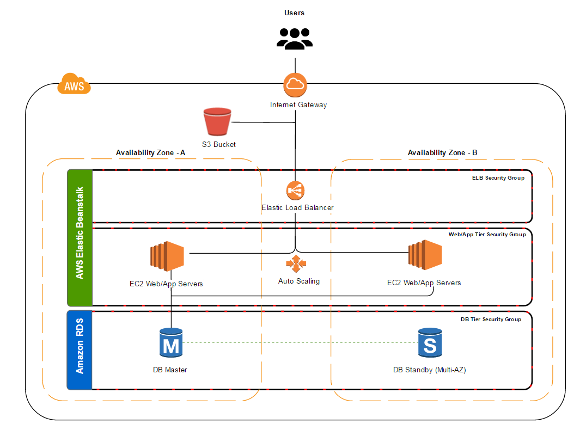

Cloud1

EC2
>stands for Elastic Compute Cloud. EC2 allow users to use virtual machines of different configurations as per their requirement.

S3 
>stands for Simple Storage Service. It allows the users to store and retrieve various types of data using API calls.

Load balancing
>simply means to hardware or software load over web servers, that improver's the efficiency of the server as well as the application.

AWS Elastic Beanstalk
> Deployment
> Capacity Provisioning
> Load Balancing
> Autoscaling
> Application Health Monitoring
Amazon Relational Database Service (RDS)
> Has Resizable Capacity
> Manages Database Administration Tasks

Schematic Diagram
https://aws.amazon.com/getting-started/hands-on/build-wordpress-website/

